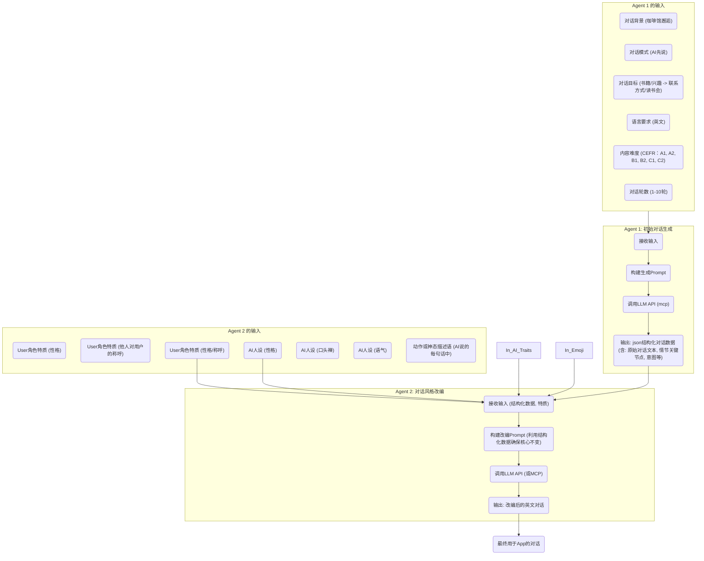
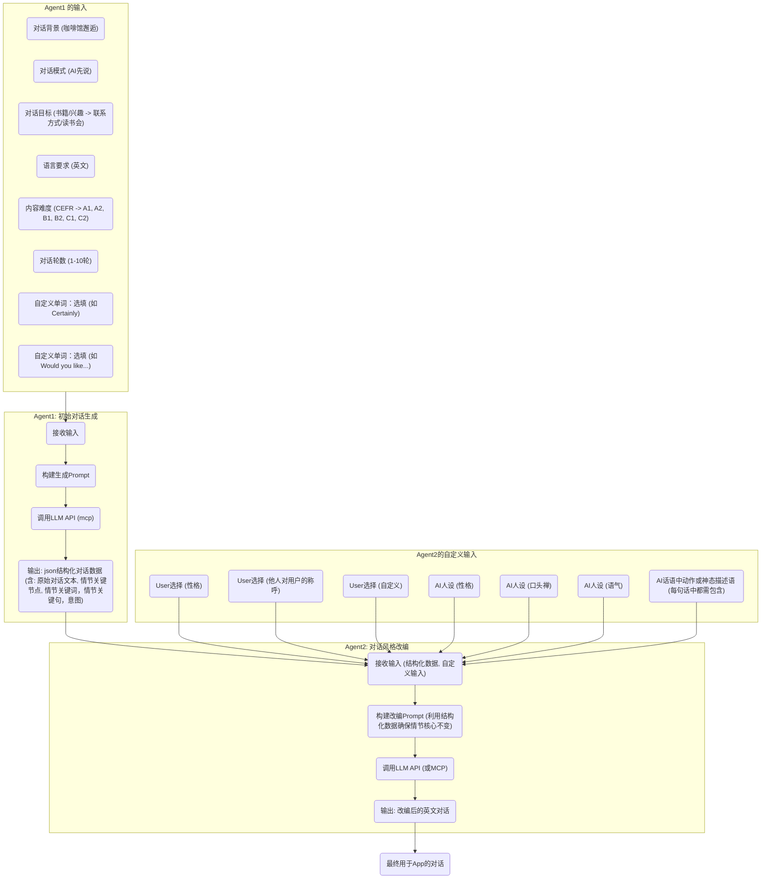

# Architecture-Diagram

## Version1

```mermaid
graph TD
    subgraph Inputs_Agent1 [Agent 1 的输入]
        direction LR
        In_Ctx("对话背景 (咖啡馆邂逅)")
	    In_Dialogue("对话模式 (AI先说)")
        In_Goal("对话目标 (书籍/兴趣 -> 联系方式/读书会)")
        In_Lang("语言要求 (英文)")
        In_Difficluty("内容难度 (CEFR：A1, A2, B1, B2, C1, C2)")
        In_NumCtx("对话轮数 (1-10轮)")
    end

    subgraph Agent1_Process [Agent 1: 初始对话生成]
        direction LR
        A1_CombineInput("接收输入") --> A2_BuildPrompt("构建生成Prompt")
        A2_BuildPrompt --> A3_APICall("调用LLM API (mcp)")
        A3_APICall --> A4_Output("输出: json结构化对话数据 (含: 原始对话文本, 情节关键节点, 意图等)")
    end

    subgraph Inputs_Agent2 [Agent 2 的输入]
        direction LR
        In_User_Traits_Chara("User角色特质 (性格)")
        In_User_Traits_Address("User角色特质 (他人对用户的称呼)")
        In_User_Traits("User角色特质 (性格/称呼)")
        In_AI_Traits_Chara("AI人设 (性格)")
        In_AI_Traits_Mantra("AI人设 (口头禅)")
        In_AI_Traits_Tone("AI人设 (语气)")
        In_AI_Emo("动作或神态描述语 (AI说的每句话中)")
        %% Agent 1的输出 A4_Output 也是 Agent 2 的核心输入
    end

    subgraph Agent2_Process [Agent 2: 对话风格改编]
        direction LR
        %% B1接收来自Agent1的输出以及用户特质
        B1_CombineInput("接收输入 (结构化数据, 特质)") --> B2_BuildPrompt("构建改编Prompt (利用结构化数据确保核心不变)")
        B2_BuildPrompt --> B3_ResponseAPICall("调用LLM API (或MCP)")
        B3_ResponseAPICall --> B4_Output("输出: 改编后的英文对话")
    end

    %% 定义流程连接
    Inputs_Agent1 --> A1_CombineInput
    A4_Output --> B1_CombineInput
    In_User_Traits --> B1_CombineInput
    In_AI_Traits --> B1_CombineInput
    In_Emoji --> B1_CombineInput
    In_AI_Traits_Chara --> B1_CombineInput
    B4_Output --> FinalOutput("最终用于App的对话")
```

## Version2

```mermaid

graph TD
    subgraph Inputs_Agent1 [Agent1 的输入]
        direction LR
        In_Ctx("对话背景 (咖啡馆邂逅)")
	    In_Dialogue("对话模式 (AI先说)")
        In_Goal("对话目标 (书籍/兴趣 -> 联系方式/读书会)")
        In_Lang("语言要求 (英文)")
        In_Difficluty("内容难度 (CEFR -> A1, A2, B1, B2, C1, C2)")
        In_NumTurn("对话轮数 (1-10轮)")
        In_Custom_Vocabulary("自定义单词：选填 (如Certainly)")
        In_Custom_Sentence("自定义单词：选填 (如Would you like...)")
    end

    subgraph Agent1_Process [Agent1: 初始对话生成]
        direction LR
        A1_CombineInput("接收输入") --> A2_BuildPrompt("构建生成Prompt")
        A2_BuildPrompt --> A3_APICall("调用LLM API (mcp)")
        A3_APICall --> A4_Output("输出: json结构化对话数据 (含: 原始对话文本, 情节关键节点, 情节关键词，情节关键句，意图)")
    end

    subgraph Inputs_Agent2 [Agent2的自定义输入]
        direction LR
        In_User_Traits_Chara("User选择 (性格)")
        In_User_Traits_Address("User选择 (他人对用户的称呼)")
        In_User_Traits_Custom("User选择 (自定义)")
        In_AI_Traits_Chara("AI人设 (性格)")
        In_AI_Traits_Mantra("AI人设 (口头禅)")
        In_AI_Traits_Tone("AI人设 (语气)")
        In_AI_Emo("AI话语中动作或神态描述语 (每句话中都需包含)")
        %% Agent 1的输出 A4_Output 也是 Agent 2 的核心输入
    end

    subgraph Agent2_Process [Agent2: 对话风格改编]
        direction LR
        %% B1接收来自Agent1的输出以及用户特质
        B1_CombineInput("接收输入 (结构化数据, 自定义输入)") --> B2_BuildPrompt("构建改编Prompt (利用结构化数据确保情节核心不变)")
        B2_BuildPrompt --> B3_ResponseAPICall("调用LLM API (或MCP)")
        B3_ResponseAPICall --> B4_Output("输出: 改编后的英文对话")
    end

    %% 定义流程连接
    Inputs_Agent1 --> A1_CombineInput
    A4_Output --> B1_CombineInput
    In_User_Traits_Chara --> B1_CombineInput
    In_User_Traits_Address --> B1_CombineInput
    In_User_Traits_Custom --> B1_CombineInput
    In_AI_Traits_Chara --> B1_CombineInput
    In_AI_Traits_Mantra --> B1_CombineInput
    In_AI_Traits_Tone --> B1_CombineInput
    In_AI_Emo --> B1_CombineInput
    B4_Output --> FinalOutput("最终用于App的对话")
```

